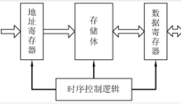
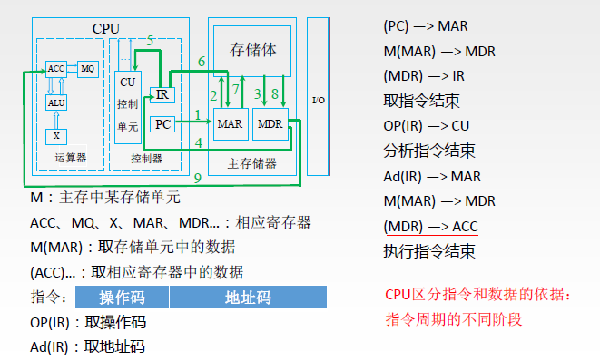
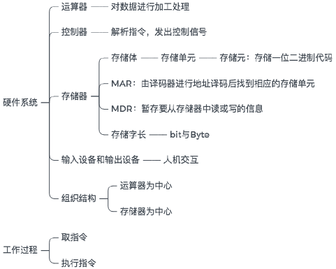
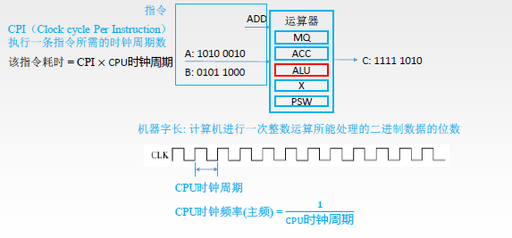
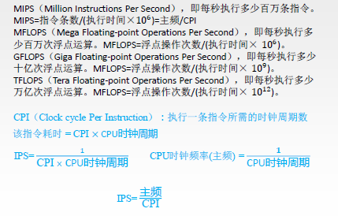

> ### 计算机硬件发展

- 
- 第一代
  - 电子管时代
  - 第一台电子数字计算机：ENIAC
- 第二代
  - 晶体管时代
  - 面向过程的程序设计语言：FORTRAN
  - 操作系统雏形
- 第三代
  - 中小规模集成电路
  - 分时操作系统
- 第四代
  - 超大规模集成电路
  - 产生了微处理器
  - 并行，流水线，高速缓存
- 
- 摩尔定律：集成电路上可容纳的晶体管数目，约每隔18个月便会增加一倍，整体性能也将提升一倍。

 

> ### 计算机的分类与发展方向

- 电子模拟计算机：连续
- 电子数字计算机：离散
  - 通用计算机：适用性强
    - 巨型机
    - 大型机
    - 中型机
    - 小型机
    - 微型机
    - 单片机
  - 专用计算机：速度快，效率高，针对特殊任务
- 指令和数据流
  - 单指令流和单数据流（SISD）：冯诺依曼体系结构
  - 单指令流和多数据流（SIMD）：阵列处理器、向量处理器
  - 多指令流和但数据流（MISD）：实际上不存在
  - 多指令流和多数据流（MIMD）：多处理器、多计算机
- 

 

> ### 计算机硬件的基本组成

- 冯诺依曼计算机
  - “存储程序”：将指令以代码的形式实现输入到计算机主存储器中，然后按其在存储器中的首地址执行程序的第一条指令，以后就按照该程序的规定顺序执行其他指令，知道程序执行结束。
  - 特点
    - 计算机硬件系统由运算器、存储器、控制器、输入设备和输出设备5大部件组成。
    - 指令和数据以同等地位存于存储器内，并课按地址寻访。
    - 指令和数据都是二进制代码表示。
    - 指令由操作码和地址码组成。
    - 指令在存储器内按顺序存放。通常，指令是顺序执行的，在特定条件下，可根据运算结果或根据设定的条件改变执行顺序。
    - 早起的冯诺依曼机以运算器为中心，输入/输出设备通过运算器与存储器传送数据。
  - 
- 

 

> ### 存储器

- 是计算机的存储部件，用来存放程序和数据。
- 存储器分为
  - 主存储器：CPU能直接访问的
  - 辅助存储器：帮助主存记忆更多信息。
- 工作方式
  - 按存储单元的地址进行存取的，这种存取方式陈伟按地址存取方式。
- 基本组成
  - 
  - 存储体：存放二进制信息
  - 地址寄存器（MAR）：存放地址，经过地址译码找到所选的存储单元。
    - MAR用于寻址，位数对应着存储单元的个数。如MAR为10为，则有2^10=1024个存储单元，记为1k。MAR的长度与PC的长度相同。
  - 数据寄存器（MDR）：暂存要从存储器中读或写的信息。
    - MDR的位数和存储字长相等。一般为字节的二次幂整数倍。

 

> ### 运算器和控制器

- 运算器
  - 计算机的执行部件，完成算数运算和逻辑运算。
    - 算术运算：加减乘除
    - 逻辑运算：与或非、异或、比较
  - 核心是算数逻辑单元ALU，还包含通用寄存器
    - 累加器ACC
    - 乘商寄存器MQ
    - 操作数寄存器X
    - 变址寄存器IX
    - 基址寄存器BR
    - 程序状态寄存器PSW
- 控制器
  - 是计算机的指挥中心
    - 计数器PC：用来存放当前欲执行指令的地址
    - 指令寄存器IR：存放当前的指令，内容来自主存的MDR。
    - 控制单元CU

 

> ### I/O设备

- 输入设备
  - 键盘鼠标
  - 摄像机
- 输出设备
  - 显示器
  - 打印机
- 辅助存储
  - U盘
  - 硬盘
- I/O接口

 

> ### 计算机系统多级层次结构

- 层次结构
  - 微程序机器M0（微指令系统）：由硬件直接执行微指令
  - 传统机器M1（用机器语言的机器）：直接执行二进制代码
  - 虚拟机器M2（操作系统机器）：用机器语言解释操作系统
  - 虚拟机器M3（汇编语言机器）：用汇编语言翻译成机器语言程序
  - 虚拟机器M4（高级语言机器）：用编译程序翻译成汇编语言程序

 

> ### 计算机性能指标

- 机器字长：计算机进行一次整数运算所能处理的二进制数据位数。
- 数据通道带宽：数据通路带宽是指数数据总线一次所能并行传送信息的位数。
- 主存容量：主存储器所能存储信息的最大容量，通常用**字节**来衡量，也可以用字数x字长。MAR的位数反映了存储单元的个数，MDR的位数反映了可寻址范围的最大值。
  - eg：MAR是16位，则2^16=65536，即存储体内有65536个存储单元，若MDR为32位，表示最大容量为64K x 32位
- 
- 
- 