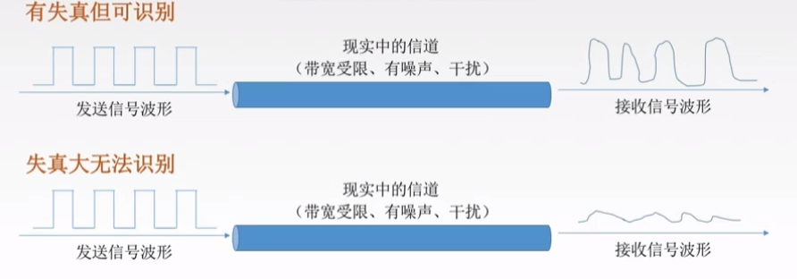
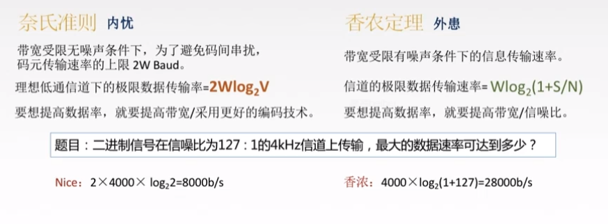

- 影响失真程度的因素
  - 码元传输速率
  - 信号传输距离
  - 噪声干扰
  - 传输媒体质量
  - 
- 失真的一种现象-**码间串扰**
  - 信号带宽：信道能通过的最高频率和最低频率之差
  - 码间串扰：接收端收到的信号波形失去了码元之间清晰界限的现象。 （频率太高）
- **奈氏准则**（奈奎斯特定理）：在理想低通（无噪声，带宽受限）条件下，为了避免码间串扰，极限码元传输速率为2W Baud， W是信道带宽，单位是Hz。
  - 
  - 在任何信道中，码元传输的速率是有上限的。若传输速率超过此上限，就会发现严重的码间串扰问题，使接收端对码元的完全正确识别成为不可能。
  - 信道的**频带越宽**（即能通过的信号高频分量越多），就可以用更高的速率进行码元的有效传输。
  - 奈氏准则给出了码元传输速率的限制，但没有对信息传输速率给出限制。
  - 由于码元的传输速率受奈氏准则的制约，所以要提高数据的传输速率，就必须设法使每个码元能携带更多个比特的信息量，这就需要采用多元制的调制方法。
  - 

 

> ### 香农定理

- **噪声**存在于所有的电子设备和通信信道汇总，由于噪声随机产生，它的瞬间值有时候会很大，因此噪声会使接收端对码元的判决产生错误。但是噪声的影响是相对的，若信号强，那么噪声影响相对较小。因此，信噪比很重要。
- 信噪比 = 信号的平均功率/噪声的平均功率，常记为S/N，用分贝（dB）作为度量单位
  - 信噪比（dB） = 10log10（S/N）
- **香农定理**：在带宽受限且有噪声的信道中，为了不产生误差，信息的数据传输速率有上限值。
  - 
  - 信道的带宽或信道中的信噪比越大，则信息的极限传输速率就越高。
  - 对一定的传输带宽和一定的信噪比，信息传输速率的上限就确定了。
  - 只要信息的传输速率低于信道的极限传输速率，就一定能找到某种方法来实现无差别的传输。
  - 香农定理得出的为极限信息传输速率，实际信道能达到的传输速率要比它低。
  - 
  - 

