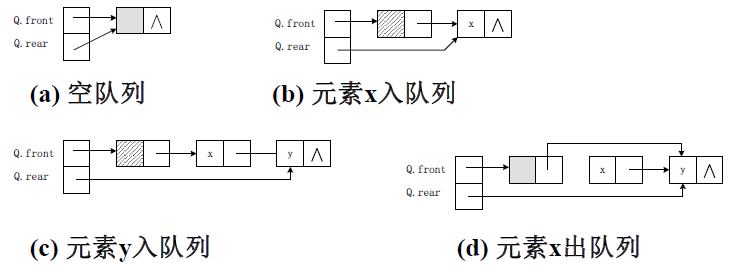

> ### 栈

- 定义：只能在表的一端（栈顶）进行插入和删除运算的线性表
- 逻辑结构：与线性表相同，仍为一对一关系
- 存储结构：用顺序栈或者链栈存储均可
- 运算规则：只能在栈顶运算，先进先出原则
- 基本操作：入栈、出栈。读栈顶元素、建栈、判断栈满、栈空

<br>

> ### 顺序栈

- 表示

  - ```c++
    #define MAXSIZE 100
    typedef struct
    {
        SElemType *base;
        SElemType *top;
        int stacksize;
    }SqStack;
    ```

- 初始化

  - 分配空间并检查是否分配失败，失败就返回错误

  - 设置栈底和栈顶指针S.top = S.base

  - 设置栈的大小

  - ```C++
    Status InitStack(SqStack &S)
    {
        S.base = new SElemType[MAXSIZE];
        if(!S.base)
            return OVERFLOW;
        S.top = S.base;
        S.stackSize = MAXSIZE;
        return OK;
    }
    ```

- 判断顺序表是否为空

  - ```c++
    bool StackEmpty(SqStack S)
    {
        if(S.top == S.base)
            return true;
        else
            return false;
    }
    ```

- 求顺序栈的长度

  - ```c++
    int StackLength(SqStack S)
    {
        return S.top - S.base;
    }
    ```

- 清空顺序栈

  - ```c++
    Status ClearStack(SqStack S)
    {
        if(S.base)
            S.top = S.base;
        return OK;
    }
    ```

- 销毁顺序栈

  - ```c++
    Status DestroyStack(SqStack &S)
    {
        if(S.base)
        {
            delete S.base;
            S.stacksize = 0;
            S.base = S.top = NULL'
        }
        return OK;
    }
    ```

- 顺序栈进栈

  - 判断是否栈满，若满则出错

  - 元素e压入栈顶

  - 栈顶指针加1

  - ```c++
    Status Push(SqStack &S, SElemtype e)
    {
        if(S.top-S.base == S.stacksize)
            return ERROR;
        *S.top++ = e;
        return OK;
    }
    ```

- 顺序栈出栈

  - 判断是否栈空，若空啧出错

  - 获取栈顶元素e

  - 栈顶指针-1

  - ```c++
    Status Pop(SqStack &S, SElemType &e)
    {
        if(S.top == S.base)
            return ERROR;
        e = *--S.top;
        return OK;
    }
    ```

- 取顺序栈栈顶元素

  - 判断是否空栈，若空则返回错误
  
  - 否则通过栈顶指针获取栈顶元素
  
  - ```c++
    Status GetTop(SqStack S, SElemType &e)
    {
        if(S.top == S.base)
            return ERROR;
        e = *(S.top-1);
        return OK;
    }
    ```

<br>

> ### 链栈

- 表示

  - 运算是受限的单链表，只能在链表头部进行操作，故没必要附加头结点。

  - **栈顶指针**是链表的头指针

  - ```c++
    typedef struct StackNode
    {
        SElemType data;
        struct StackNode *next;
    }StackNode,*LinkStack;
    LinkStack S;
    ```

- 初始化

  - ```c++
    void InitStack(LinkStack &S)
    {
        S = NULL;
    }
    ```

- 判断链栈是否为空

  - ```c++
    Status StackEmpty(LinkStack S)
    {
        if(S==NULL)
            return TRUE;
        else
            return FALSE;
    }
    ```

- 链栈进栈

  - ```c++
    Status Push(LinkStack &S,SElemType e)
    {
        p = new StackNode;
        if(!p)
            exit(OVERFLOW);
        p->data = e;
        p->next = S;
        S = p;
        return OK;
    }
    ```

- 链栈出栈

  - ```c++
    Status Pop(LinkStack &S,SElemType &e)
    {
        if(s == NULL)
            return ERROR;
        e = S->data;
        p = S;
        S = S->next;
        delete p;
        return OK;
    }
    ```

- 取链栈栈顶元素

  - ```c++
    SElemType GetTop(LinkStack S)
    {
        if(S==NULL)
            exit(1);
        else
            return S->data;
    }
    ```

<br>

> ### 队列

- 定义：只能在表的队尾进行插入，在队头进行删除运算的线性表

- 逻辑结构：与线性表相同，一对一结构

- 存储结构：用顺序队列或者链队

- 运算规则：先进先出

- 栈、队列和一般线性表区别

  - 栈和队列是一种特殊的线性表
    - 区别：仅在于运算规则不同
  - 一般线性表
    - 逻辑结构：一对一
    - 存储结构：顺序表、链表
    - 运算规则：随机、顺序存取
  - 栈
    - 逻辑结构：一对一
    - 存储结构：顺序栈、链栈
    - 运算规则：后进先出
  - 队列
    - 逻辑结构：一对一
    - 存储结构：顺序队、链队
    - 运算规则：先进先出

- 循环队列

  - ```c++
    #define M 100
    typedef struct
    {
        QElemType *base;
        int front;
        int rear;
    }SqQueue;
    ```

- 循环队列初始化

  - ```c++
    Status InitQueue(SqQueue &Q)
    {
        Q.base = new QElemType[M];
        if(!Q.base)
            exit(OVERFLOW);
        Q.front = Q.rear = 0;
        return OK;
    }
    ```

- 求循环队列的长度

  - ```c++
    int QueueLength(SqQueue Q)
    {
        return(Q.rear-Q.front+MAXSIZE)%MAXSIZE;
    }
    ```

- 循环队列入队

  - ```c++
    Status EnQueue(SqQueue &Q,QElemType e)
    {
        if((Q.rear+1)%MAXSIZE==Q.front)
            return ERROR;
        Q.base[Q.rear] = e;
        Q.rear = (Q.rear+1)%MAXSIZE;
        return OK;
    }
    ```

- 循环队列出队

  - ```c++
    Status DeQueue(LinkQueue &Q,QElemType &e)
    {
    	if(Q.front==Q.rear)
    		return ERROR;
        e = Q.base[Q.front];
        Q.front = (Q.front+1)%MAXSIZE;
        return OK;
    }
    ```

- 链队列

  - ```c++
    typedef struct QNode
    {
        QElemType data;
        struct QNode *next;
    }QNode,*QueuePtr;
    typedef struct
    {
        QueuePtr front;
        QueuePtr rear;
    }LinkQueue;
    ```

  - 

- 链队初始化

  - ```c++
    Status InitQueue(LinkQueue &Q)
    {
        Q.front = Q.rear = (QueuePtr)malloc(sizeof(QNode));
        if(!Q.front)
            exit(OVERFLOW);
        Q.front->next = NULL;
        return OK;
    }
    ```

- 销毁链队

  - ```c++
    Status DestroyQueue(LinkQueue &Q)
    {
        while(Q.front)
        {
            Q.rear = Q.front->next;
            free(Q.front);
            Q.front = Q.rear;
        }
        return OK;
    }
    ```

- 判断链队是否为空

  - ```c++
    Status QueueEmpty(LinkQueue Q)
    {
        return(Q.front==Q.rear);
    }
    ```

- 求链队的队头元素

  - ```c++
    Status GetHead(LinkQueue Q,QElemType &e)
    {
        if(Q.front == Q.rear)
            return ERROR;
        e = Q.front->next->data;
        return OK;
    }
    ```

- 链队入队

  - ```c++
    Status EnQueue(LinkQueue &Q,QElemType e)
    {
        p = (QueuePtr)malloc(sizeof(QNode));
        if(!p)
            exit(OVERFLOW);
        p->data = e;
        p->next = NULL;
        Q.rear->next = p;
        Q.rear = p;
        return OK;
    }
    ```

- 链队出队

  - ```c++
    Status DeQueue(LinkQueue &Q, QElemType &e)
    {
        if(Q.front == Q.rear)
            return ERROR;
        p = Q.front->next;
        e = p->data;
        Q.front->next = p->next;
        if(Q.rear==p)
            Q.rear = Q.front;
        delete p;
        return OK;
    }
    ```

    