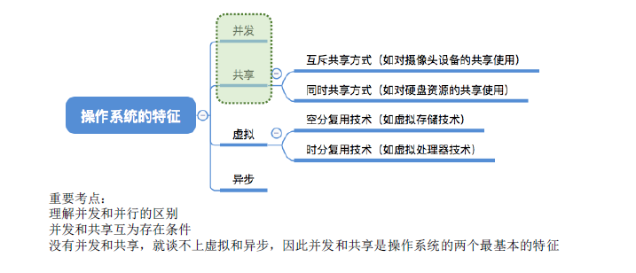

> ### 操作系统的概念/功能/目标

- **操作系统**:是指控制和管理整个计算机系统的硬件和软件资源。他是计算机系统中最基本的**系统软件**。
- 功能和目标
  - 作为系统资源的管理者
    - 处理器管理
    - 存储器管理
    - 文件管理
    - 设备管理
  - 作为用户与计算机硬件之间的接口
    - 命令接口：允许用户直接使用
      - 联机命令接口：用户说一句/系统做一句
      - 脱机命令接口：用户说一堆/用户做一堆
    - 程序接口：用户通过程序间接使用/由一组**系统调用**组成（程序接口=系统调用）
    - GUI：线代操作系统中最流行的图形用户接口
    - 
  - 作为最接近硬件的层次:实现对硬件的拓展

 

> ### 操作系统的特征

- **并发**：指两个或多个事件在同一时间间隔内发生。这些事件宏观上是同时发生的。但**微观上是交替发生**的。
  - 易混淆：并行
    - 并行：指两个或多个时间在同一时刻同时发生。
  - 操作系统会负责协调多个程序交替执行
    - 操作系统和程序并发是一起诞生的
  - 4核可以并行四个程序，但是并发性**依然必不可少**
- **共享**：资源共享，系统中的资源可供内存中多个并发执行的进程共同使用。
  - 互斥共享
    - 一个时间段内只允许一个进程访问该资源
    - 摄像头只能分配给一个进程
  - 同时共享
    - 允许一个时间段内多个进程“同时”对它们进行访问
    - 宏观上同时，实际可能是交替的
    - 同时发送两个文件，访问硬盘
- **并发和共享**
  - 并发性是指计算机系统中同时存在多个运行着的程序
  - 共享性是指系统中的资源可供内存中多个并发执行的进程共同使用
- **虚拟**：把一个物理上的实体变为若干个逻辑上的对应物。物理实体是实际存在的，而逻辑上的对应物是用户感受到的。
  - 空分复用（虚拟存储器技术）
  - 时分复用（虚拟处理器）
- **异步**：多道程序环境下，允许多个程序并发执行，但由于资源有限，进程的执行不是一贯到底的，而是走走停停，以不可预知的速度向前推进，这就是进程的异步性。
  - 只有系统拥有了并发性才有可能导致异步。

